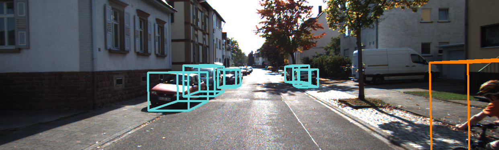
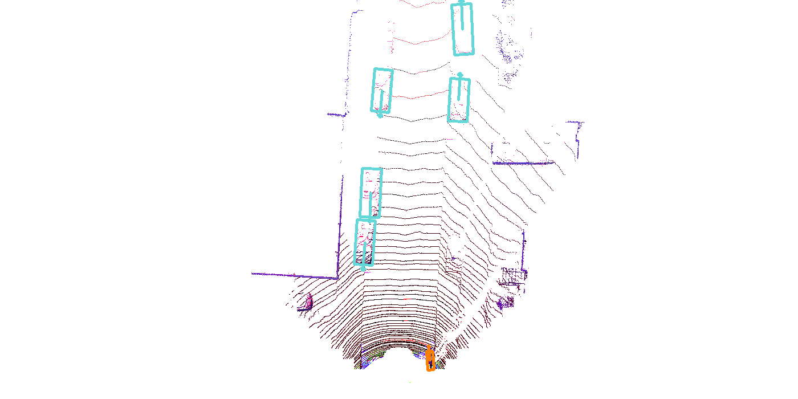

# BirdNet+: End-to-End 3D Object Detection in LiDAR Bird’s Eye View




[BirdNet+](https://arxiv.org/abs/2003.04188) software implements a state-of-the-art 3D object detection algorithm based only on LiDAR technology. It represents a clear advance on its predecessor, the [BirdNet](https://arxiv.org/abs/1805.01195).
Algorithm developed at the Universidad Carlos III de Madrid.

### What's New
- The framework behind the algorithm is [Detectron2](https://github.com/facebookresearch/detectron2) in Pytorch.
- Removes all the post processing stage using only the network to perform 3D predictions, which improves the detection accuracy.

### Installation

You will need the Detectron2 requirements:
- Linux with Python ≥ 3.6
- PyTorch ≥ 1.3
- [torchvision](https://github.com/pytorch/vision/) that matches the PyTorch installation.
	You can install them together at [pytorch.org](https://pytorch.org) to make sure of this.
- OpenCV
- pycocotools: `pip install cython; pip install -U 'git+https://github.com/cocodataset/cocoapi.git#subdirectory=PythonAPI'`

After having the above dependencies and gcc & g++ ≥ 5, run:
```
git clone https://github.com/AlejandroBarrera/birdnet2
cd birdnet2 && python -m pip install -e .
```

Please refer to the [Detectron2 installation section](https://github.com/facebookresearch/detectron2/blob/master/INSTALL.md) for more details.

### Quick Start

1. Add birdnet2 top level to your PYTHONPATH.
```
export DETECTRON_ROOT=/path/to/birdnet2
export PYTHONPATH=$PYTHONPATH:$DETECTRON_ROOT
```
2. Download the pre-trained model from [here](https://www.dropbox.com/s/5v9hczmpw1ijuis/ITSC_2020_model.pth?dl=1) and put it in a new folder named **models** inside DETECTRON_ROOT (you can change this path through the field **OUTPUT_DIR** in the configuration file *Base-BirdNetPlus.yaml*)
3. Launch the script *python demo/demo_BirdNetPlus.py* for an example of how BirdNet+ works.

This demo uses data from the [KITTI Vision Benchmark Suite](http://www.cvlibs.net/datasets/kitti/).

### Usage

0. Follow the steps 1 and 2 from Quick Start.
1. Download the training and validation splits [here](https://xiaozhichen.github.io/files/mv3d/imagesets.tar.gz).
2. To train with [KITTI object detection dataset](http://www.cvlibs.net/datasets/kitti/eval_object.php):
- Download the dataset.
- Generate BEV KITTI images. The tool that we used can be found at [lidar_bev](https://github.com/beltransen/lidar_bev).
- In DETECTRON_ROOT, arrange everything according to the directory tree below (We leave annotations folder empty for now):
```
.
|-- datasets
|   |-- bv_kitti
|   |   |-- annotations
|   |   |   |-- {train,val} JSON files
|   |   |-- lists
|   |   |   |-- {train,val} splits
|   |   |-- image
|   |   |   |-- BEV KITTI {train,val} images
|   |   |-- label
|   |   |   |-- KITTI {train,val} labels
|   |   |-- calib
|   |   |   |-- KITTI calibration files
```
NOTE: In the current version, the *label* subfolder must contain the original KITTI annotations (*label_2*).

3. Launch *python tools/train_net_BirdNetPlus.py --config_file Base-BirdNetPlus* with the parameters required inside of the configuration file. The annotations are generated automatically.
4. For validation use *python tools/val_net_BirdNetPlus.py* instead with as many arguments as you want. Please review the arguments carefully. For the evaluation, we strongly recommend using an offline KITTI evaluator such as [eval_kitti](https://github.com/cguindel/eval_kitti) after obtaining the evaluation annotations.


### Citation

If you use BirdNet+ in your research, please cite our work using the following BibTeX entry.
```
@article{barrera2021birdnet+,
  title={BirdNet+: Two-Stage 3D Object Detection in LiDAR Through a Sparsity-Invariant Bird’s Eye View},
  author={Barrera, Alejandro and Beltr{\'a}n, Jorge and Guindel, Carlos and Iglesias, Jos{\'e} Antonio and Garc{\'\i}a, Fernando},
  journal={IEEE Access},
  volume={9},
  pages={160299--160316},
  year={2021},
  publisher={IEEE}
}
```
